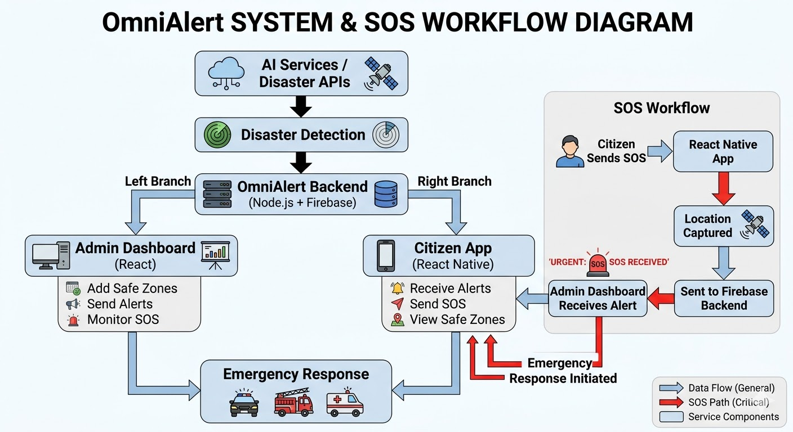

# OmniAlert --- Know Before, Act Before 🚨

 

AI-powered disaster preparedness platform that provides **real-time
alerts, safe zone guidance, and SOS emergency communication** to help
citizens respond quickly during disasters.

Repository: https://github.com/RahilJamadar/OmniAlert

------------------------------------------------------------------------

# Table of Contents

-   Overview
-   Problem Statement
-   Solution
-   System & SOS Workflow Diagram
-   Features
-   Technologies Used
-   System Architecture
-   Setup Guide
-   AI Usage Disclosure
-   Future Improvements
-   Team

------------------------------------------------------------------------

# Overview

OmniAlert is a disaster preparedness platform that connects **citizens
and authorities** using real‑time alerts and emergency communication.

The platform consists of:

-   **Admin Dashboard (React Web App)**
-   **Citizen Mobile App (React Native)**
-   **Backend services (Node.js + Firebase)**
-   **AI-powered disaster detection and monitoring**

------------------------------------------------------------------------

# Problem Statement

Natural disasters such as **fires, floods, earthquakes, and cyclones**
often occur without sufficient warning.

Common challenges:

-   People receive alerts too late
-   Citizens do not know nearby safe shelters
-   Emergency services cannot quickly identify affected locations
-   Communication during disasters is limited

------------------------------------------------------------------------

# Solution

OmniAlert solves these problems by providing:

• Real-time disaster alerts\
• Safe zone discovery\
• SOS emergency communication\
• Admin monitoring dashboard\
• AI-assisted disaster detection

The goal is to help communities **know before danger arrives and act
before it is too late.**

------------------------------------------------------------------------

# System & SOS Workflow Diagram

Place the diagram image in your repository and it will automatically
appear here.

------------------------------------------------------------------------

# Features

## Real-Time Disaster Alerts

Users receive notifications when disasters occur nearby.

## Safe Zone Navigation

Citizens can locate nearby shelters and evacuation points.

## SOS Emergency System

Users can send SOS alerts with their live location.

## Disaster Monitoring Dashboard

Authorities can monitor incidents and citizen requests.

## Emergency Response Support

SOS alerts help emergency responders identify affected locations
quickly.

------------------------------------------------------------------------

# Technologies Used

## Frontend

-   React (Admin Dashboard)
-   React Native (Citizen Mobile App)

## Backend

-   Node.js

## Database

-   MongoDB

## Cloud Services

-   Firebase (real-time alerts and notifications)

## APIs

-   NASA API
-   Open Router API
-   Google Maps API

## AI Services

AI tools assist with disaster detection and data analysis.

------------------------------------------------------------------------

# System Architecture

Admin Dashboard (React)\
↓\
Backend Server (Node.js)\
↓\
Firebase Cloud Services\
↓\
Citizen Mobile App (React Native)\
↓\
External APIs + AI Services

------------------------------------------------------------------------

# Setup Guide

### Clone Repository

git clone https://github.com/RahilJamadar/OmniAlert

### Install Dependencies

npm install

### Run Backend

npm start

### Run Admin Dashboard

npm run dev

### Run Mobile App

npx react-native run-android

------------------------------------------------------------------------

# AI Usage Disclosure

The following AI tools were used during development:

-   ChatGPT
-   Google Gemini
-   GitHub Copilot
-   Cursor AI

AI tools were used for **development assistance, idea generation, and
documentation support**.

The final implementation and integration were completed by the
**OmniAlert team**.

------------------------------------------------------------------------

# Future Improvements

-   Government disaster API integration
-   SMS emergency alerts
-   AI-based disaster prediction
-   IoT sensor monitoring
-   Drone-based disaster monitoring

------------------------------------------------------------------------

# Team

-   Asif
-   Rahil
-   Kutbuddin Shaikh

------------------------------------------------------------------------

# Tagline

**OmniAlert --- Know Before, Act Before**
